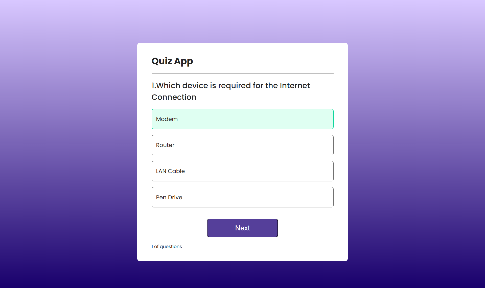
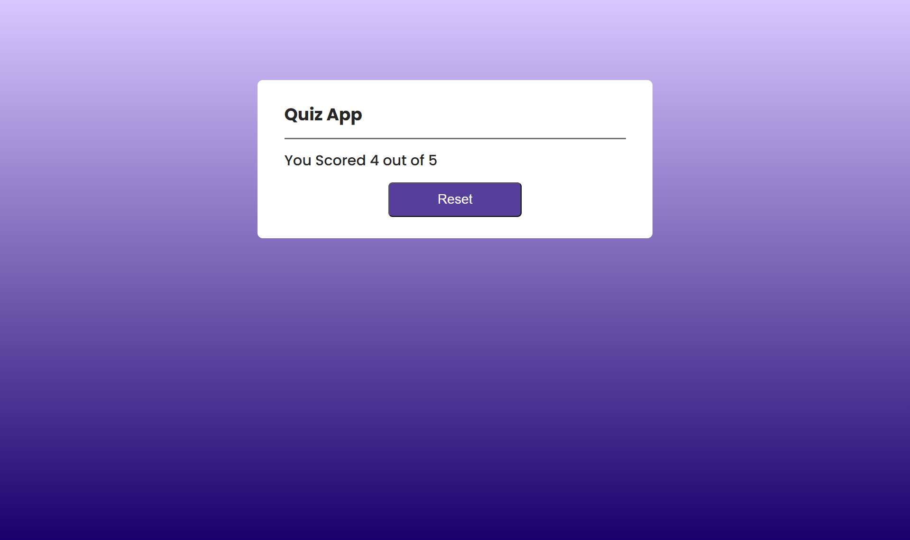

# 📝 Quiz App (React)

A simple and interactive **Quiz Application** built using **React.js**.  
The app displays multiple-choice questions, highlights correct/wrong answers, and shows the final score at the end of the quiz.

---

## 🚀 Features

- ✅ Displays one question at a time with four options.
- ✅ Highlights selected answer:
  - 🟢 Green for correct
  - 🔴 Red for wrong
- ✅ Shows correct answer even if user selects wrong option.
- ✅ Tracks score throughout the quiz.
- ✅ Shows result screen after last question.
- ✅ Reset button to restart the quiz.

---

## 🖼️ Demo

  
  
  

---

## 🛠️ Tech Stack

- **React.js** – UI development
- **useState & useRef** – State and DOM manipulation
- **CSS** – Styling
- **JavaScript (ES6)** – Logic & interactivity

---

## 📂 Project Structure

